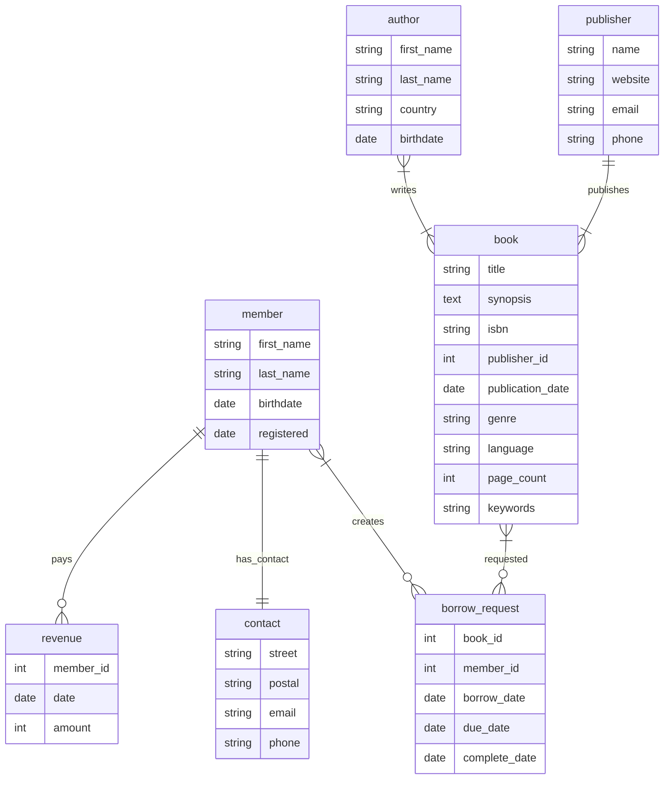

# Library Management System - Database

The `libms-db` project is a demonstrative and training-oriented initiative
designed to offer hands-on experience with SQL. Focusing on the realm of
library management, this project encompasses SQL scripts that detail
the creation of tables pertinent to the system, as well as their subsequent
population with mock data.

**Table of Contents**

-  [Getting started](#getting-started)
   - [Database initialization](#database-initialization)
   - [Using Docker Compose](#using-docker-compose) 

## Getting started

**Prerequisites**

- PostgreSQL server is available
- PostgreSQl client is available

This repository comes with all required queries. It is assumed you're using
`libms` both as the postgres role and the database.

### Database initialization

Your first task is to create PostgreSQL role and database. You may find the
initialization queries to do this in *docker/db/init.sql*. In case of using
`docker compose` this query is already applied for the PostgreSQL server,
and no additional actions required. In case you're trying to set up `libms`
for some another PostgreSQL server, just run the queries from the *init.sql*
file on the RDBMS server. You'll need permissions to create roles and databases
to do this.

### Using Docker Compose

Prerequisites:

- docker compose installed

This project comes with a docker compose file to deploy services recommended
for the Django training. If you are not familiar with docker compose, it is
a tool for containers management
([Would you like to know more?](https://docs.docker.com/compose/)).

The installation process is described
[here](https://docs.docker.com/compose/install/).

The compose file defines a minimalistic set of database server and GUI client
running in individual containers. You need to map ports from your machine to
docker containers to get things working well. Default mapped ports are:

- 5432 for the `postgres` service
- 5050 for the `pgadmin` service

You can change these values by modifying environment variables.

The containers management is simple as:

```shell
docker compose up -d  # start all containers
docker compose down   # stop all containers
```

#### Setting up env variables

Some settings declared in the compose file may be overriden by setting up
environment variables. If you aren't familiar with them
[here](https://en.wikipedia.org/wiki/Environment_variable) is a Wiki article.

Just type to the terminal:

```shell
SET VARIABLE=value     # for Windows users
EXPORT VARIABLE=value  # for Unix users (Linux and MacOS)
```

#### PostgreSQL

The `db` service will run the PostgreSQL server container. It exposes 5432-port
to the host machine, so you can use it just as if you got postgres running on
your own system. The default ports mapping is "5432:5432". In case you have
already 5432-port occupied by other software, you may set up any available port
by using `POSTGRES_PORT` environment variable.

The pre-defined credentials are:

| Username | Password |
|:---------|:---------|
| postgres | postgres |
| libms    | password |

You can run this service separately from other services defined in the compose
file by:

```shell
docker compose up -d db
```

#### pgAdmin

pgAdmin is one of the most famous PostgreSQL clients. From the version 4.x it
uses a web-based UI running in your web browser. The pgAdmin container exposes
its 80-port to the host machine. By default, this port is mapped to 5050. In
case you have already 5050-port occupied by other software, you may set up any
available port by using `PGADMIN_PORT` environment variable. After running
the pgAdmin visit http://localhost:5050 in your web browser (adjust the port
number if needed).

The pre-defined credentials to connect pgAdmin are:

| Option   | Value                         |
|:---------|:------------------------------|
| email    | pgadmin@edu-python-course.org |
| password | pgadmin                       | 

While connecting to the PostgreSQL server via pgAdmin the alias for the db
container is "postgresql-server". This connection is already defined in the
"servers.json" file under the "docker" directory and there is no need to it
connect manually.

Note this may take some time to set up container and run internal server.

## Date definition language (DDL)

All schemas are defined using [Mockaroo](https://www.mockaroo.com) project
and are public available via links below:

- [author schema](https://www.mockaroo.com/e7c9c060)
- [book schema](https://www.mockaroo.com/76947240)
- [book-to-author relationship](https://www.mockaroo.com/ed78c070)
- [book borrow requests](https://www.mockaroo.com/e2412b20)
- [library members](https://www.mockaroo.com/25dd2fd0)
- [publisher companies](https://www.mockaroo.com/4ff4ce30)
- [library revenue](https://www.mockaroo.com/b8a021b0)

Also, there are Mockaroo schemas backups within this repo located inside of
[assets/mockaroo](./assets/mockaroo) directory.

Generated datasets are also available at [assets/csv](./assets/csv).

### UML diagram


